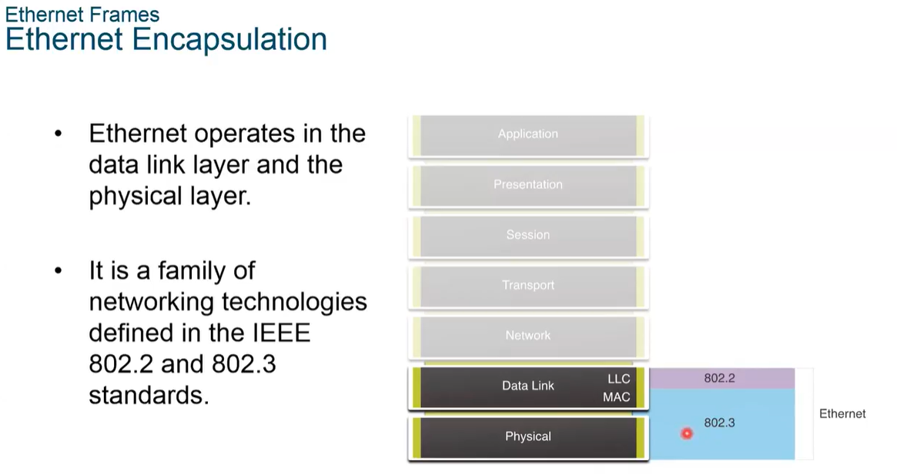
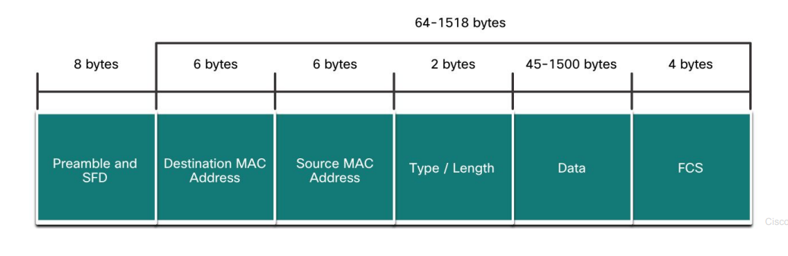
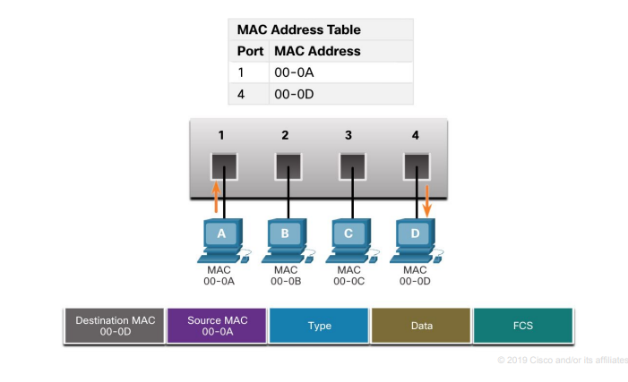

# 🔌 What Ethernet Is
- A wired networking technology for connecting devices in a LAN — uses cables (usually Cat5e, Cat6, etc.) 
- Defines rules for how data is transmitted over those cables.
- Technical name for ethernet is 802.3
- If we buy an Ethernet NIC card, it operates up to Layer 2 of the OSI model
- LLC is the part of driver, its 802.2
- Ethernet operates at the MAC sublayer (half of data link layer) and the physical layer, and called 802.3 

<br>
  



<br>

### 🧩 What It Does
- Connects all your devices together on the same network—whether it's computers, printers, routers, etc.
- Shares internet across devices: Simply plug an Ethernet cable into your device and the router or modem to get online (just like Wi-Fi, but with a cable).
  - Multiple devices can be connected to the router/modem via Ethernet cables.
  - Each device (PC, laptop, console) plugs into one of the router's Ethernet ports. Most routers have 4 LAN ports, but some may have more.
  - The router's WAN port connects to your modem or incoming internet line.
- If you need more devices connected than the router has ports, you can use a network switch. A switch adds more Ethernet ports, allowing more devices to be connected to the router.
```
A switch connects to one Ethernet port on the router and provides multiple Ethernet ports of its own.
It’s like a smart multiplug for Ethernet: while a normal multiplug simply splits power,
a switch splits the network and intelligently manages traffic.
Internally, it handles data flow between connected devices using switching logic,
effectively turning one router port into many usable connections—without slowing down or mixing up the traffic.

```
- Transfers files and shares resources between devices: Devices connected via Ethernet can send and receive data (files, etc.) from each other quickly.
- Works with Wi-Fi: Ethernet doesn’t replace Wi-Fi; it just gives wired access instead of wireless. Both can exist in the same network.
- Perfect for gaming, video calls, or large downloads because it’s more stable than Wi-Fi.


<br>

### ⚙️ How It Works
- Each device has a network interface card (NIC), which is a hardware component that allows it to connect to the network. The NIC has a unique MAC address (Media Access Control address), which helps identify the device on the network.
<br>


<br>

- Data is sent in small chunks called frames. A frame contains not only the data being sent but also control information (like the sender's MAC address, the receiver's MAC address, and error-checking information).
- Ethernet defines the rules for how these frames are formatted, sent, and checked for errors. This ensures that the data is correctly transmitted, and if there are any issues (like data corruption), the frame can be flagged and sent again if necessary.

<br>


### Ethernet vs Wi-Fi
| Feature       | Ethernet                    | Wi-Fi                       |
|---------------|-----------------------------|-----------------------------|
| Speed         | Faster                      | Slower (in most cases)      |
| Stability     | More stable (less interference) | Can be unstable             |
| Mobility      | Less portable (needs cable)  | Fully wireless              |

<br>

___

<br>


# Ethernet Frame

- Ethernet is a family of technologies used in LANs.
- Works at:
  - **Layer 1 (Physical)**: Transfers raw bits.
  - **Layer 2 (Data Link)**: Formats data into frames for transmission.
- Defined by **IEEE 802.3 (MAC)** and **IEEE 802.2 (LLC)**.

<br><br>

## **Data Link Sublayers**

### **A. LLC (Logical Link Control) – IEEE 802.2**
- Provides **protocol identification**: Marks which Layer 3 protocol (e.g., IPv4, ARP) is carried.
- Used mainly when multiple Layer 3 protocols run on one interface.

### **B. MAC (Media Access Control) – IEEE 802.3**
- Handles:
  - **Ethernet Encapsulation**: Creating and formatting Ethernet frames.
  - **Media access**: When and how to send data.
  - **MAC Addressing**: Adds MAC addresses for delivery.

<br><br>

## **MAC Sublayer Responsibilities**

### **A. Ethernet Encapsulation**

This is how Ethernet prepares data for transmission.

1. **Frame Structure**  
   The frame is the actual data unit. It contains:
   - **Preamble (7 bytes)**: Syncs receiver’s clock.
   - **Start Frame Delimiter (1 byte)**: Marks the start of the frame.
   - **Destination MAC Address (6 bytes)**
   - **Source MAC Address (6 bytes)**
   - **Type/Length (2 bytes)**: Protocol type (e.g., 0x0800 for IPv4).
   - **Payload (46–1500 bytes)**: Actual data being transported.
   - **Frame Check Sequence (4 bytes)**: CRC for error detection.

2. **MAC Addressing**
   - Source and destination MAC addresses uniquely identify the sending and receiving NICs.
   - Used for **local delivery** (within the LAN).

3. **Error Detection**
   - FCS is a CRC value calculated on the frame.
   - Receiver uses it to verify integrity. If it fails, the frame is discarded.

<br><br>

### **B. Media Access Control**

#### **Legacy Ethernet**
- Used **half-duplex** on shared media (bus topology or hubs).
- Required **CSMA/CD**:
  - Devices check if line is idle before sending.
  - If a collision occurs, they stop and retry after random delay.

#### **Modern Ethernet (with switches)**
- Uses **full-duplex** connections.
- Each link is point-to-point between NIC and switch.
- **No collisions** → CSMA/CD is not used.

<br><br>

## **Summary**
| Component | Function |
|----------|----------|
| LLC (802.2) | Identifies Layer 3 protocol |
| MAC (802.3) | Frame creation, media access, MAC addressing |
| Encapsulation | Formats data into structured Ethernet frames |
| FCS (Frame Check Sequence) | Detects errors via CRC |
| CSMA/CD | Used only in legacy, half-duplex setups |

<br>

___

<br>


# Ethernet Frame Size

The Ethernet frame size defines the valid length of a frame used in Ethernet communication, ranging from 64 to 1518 bytes (excluding the preamble), to ensure reliable data transmission and collision detection.


### What is counted in frame size?

The **Ethernet frame size** includes:
- Destination MAC (6 bytes)
- Source MAC (6 bytes)
- Type/Length (2 bytes)
- Payload (data) (45 to 1500 bytes)
- FCS (Frame Check Sequence) (4 bytes)

**Total = 64 to 1518 bytes**

<br><br>



<br><br>

```

**Important**: The **preamble (7 bytes)** and **SFD (1 byte)** are **not** included in this size. Those are handled at the physical layer and used only to help the receiver sync.


Preamble (7 bytes)  
- A pattern of alternating 1s and 0s (10101010...)  
- Purpose: Helps the receiving device **synchronize** its clock with the sender.  
- It ensures the receiver is ready to read the bits that follow.


Start Frame Delimiter (SFD) (1 byte)  
- A special byte: **10101011**  
- Purpose: Marks the **end of the preamble** and the **start of the actual frame**.  
- It tells the receiver, “The frame is about to begin.”


so basically,
- Together (7 + 1 = 8 bytes), they are used for **timing and synchronization** at the **physical layer**.  
- They are **not included** when measuring the size of an Ethernet frame (64 to 1518 bytes).  
- They come **before** the actual Ethernet frame starts.


``` 

### Minimum Frame Size – 64 bytes

- The absolute minimum valid Ethernet frame is **64 bytes**.
- This includes all headers and the FCS.
- If the data (payload) is too small, Ethernet **automatically adds padding** to reach 64 bytes.

**If a frame is smaller than 64 bytes**, it is called a:
- **Runt frame**
- **Collision fragment**

These are automatically **discarded** because they likely indicate:
- A **collision** (in older half-duplex networks), or
- **Transmission errors**

<br><br>

### Maximum Standard Frame Size – 1518 bytes

- The **maximum valid Ethernet frame** is **1518 bytes**.
- This is the total of headers, payload (up to 1500 bytes), and the 4-byte FCS.

If a frame goes beyond this limit (i.e., payload > 1500 bytes), it is **not standard** anymore.

<br><br>

### Jumbo and Baby Giant Frames

Frames **larger than 1518 bytes** fall into special categories:

- **Baby giant**: Slightly bigger than 1518 bytes (usually around 1600 bytes)  
- **Jumbo frame**: Up to 9000 bytes or more

These are **not standard IEEE 802.3 frames** but:
- Often **supported by modern NICs and switches**
- Common in **high-speed networks** (e.g., data centers) to reduce CPU usage

If a receiving device **does not support jumbo frames**, it will **drop** them.

<br><br>

### Why frame size limits matter

- Frames **less than 64 bytes** or **more than 1518 bytes** (if not supported) are considered **invalid** and dropped.
- Too small: Possibly corrupted (collision, bad cable, interference)
- Too big: Possibly malformed or unsupported

<br><br>

## Quick Recap

- Valid Ethernet frame size: **64 to 1518 bytes**
- Less than 64 → **runt/collision fragment** → dropped
- More than 1518 → **jumbo/baby giant** → only accepted if supported
- Preamble + SFD (8 bytes total) are **not included** in the size
- Payload: **46–1500 bytes**, padding added if needed
- Errors outside valid range usually mean **corruption or collision**


<br>

___

<br>


# Ethernet MAC Address 

### What is a MAC Address?

- A **MAC (Media Access Control) address** is a unique identifier assigned to a **network interface card (NIC)**.
- It operates at the **Data Link Layer (Layer 2)** of the OSI model.
- It's used for **identifying devices** within a **local area network (LAN)** — not across the internet.

<br><br>

### Format and Structure

- A MAC address is **48 bits** long.
- It’s usually shown as **12 hexadecimal digits** (since 1 hex digit = 4 bits → 12 × 4 = 48 bits).
- The MAC address is **6 bytes (octets)** in total.

**Example:**
```
48-bit binary:    00001111 10101010 00110011 01010101 11110000 00001111  
Hexadecimal:      0F-AA-33-55-F0-0F
```

<br><br>

### Hexadecimal Representation Details

- Each **byte** (8 bits) is represented by **2 hexadecimal digits**.
- So the full MAC looks like: `00-1A-2B-3C-4D-5E`
- Variations in notation include:
  - `0x00A1B2C3D4E5` (prefix `0x`)
  - `00A1B2C3D4E5₁₆` (subscript 16)
  - `00A1B2C3D4E5H` (H suffix)

**Important**: Leading zeroes are **not omitted** in MAC addresses. For example:
- Binary: `0000 1010`
- Hex: `0A` (not just A)

<br><br>

### Structure of the MAC Address

A MAC address is made up of two main parts:

#### a. **OUI (Organizationally Unique Identifier)** – First 3 bytes (24 bits)
- Assigned by **IEEE** to the manufacturer
- Identifies the **vendor or company** (e.g., Cisco, Intel, HP)

#### b. **Device Identifier** – Last 3 bytes (24 bits)
- Assigned by the **vendor**
- Ensures each MAC is **unique**

**Example:**
- MAC: `00-14-22-01-23-45`
- `00-14-22` → OUI (e.g., Dell)
- `01-23-45` → Unique device ID given by Dell


<br>

___

<br>


# Frame Processing


What Happens When a Frame is Sent?

- When a device (like your PC) sends a frame on an Ethernet network:
  - It puts its own MAC address as the Source.
  - It puts the receiver's MAC address as the Destination.

<br>
<br>

What Happens When a Device Receives a Frame?

- The NIC (Network Interface Card) looks at the Destination MAC address in the frame.
- It checks:  
  "Is this address mine (matches my MAC)?"

If yes:
- It accepts the frame and passes it up to the OSI layers (for processing the data inside).

If no:
- It drops (discards) the frame.

<br>
<br>

Special Cases — The NIC will also accept:

- Broadcast frames (sent to all devices): `FF:FF:FF:FF:FF:FF`  
- Multicast frames (if the device is subscribed to that group)


<br>

___

<br>


# Ethernet MAC Address types (Unicast, Broadcast, and Multicast)

<br>


### Unicast MAC Address

- Used when one device wants to send data to **only one specific device**.
- Every device has a **unique unicast MAC address**.
- To find this address, devices use:
  - **ARP** for IPv4
  - **ND (Neighbor Discovery)** for IPv6
- The **source MAC address is always unicast**.

<br><br>

### Broadcast MAC Address

- Used to send data to **all devices** in the local network.
- Special destination MAC address: `FF-FF-FF-FF-FF-FF`
- The switch sends it out to **every port**, except the one it came from.
- Routers **do not forward** broadcast frames.
- IPv4 broadcast IP addresses also send to all hosts in the local network.

<br><br>

### Multicast MAC Address

- Used to send data to **a group of devices**, not everyone.
- Multicast MAC addresses:
  - Start with `01-00-5E` for IPv4
  - Start with `33-33` for IPv6
- Used in things like streaming or video conferences.
- Switches forward multicast unless they’re set up to filter them (multicast snooping).
- Routers don’t forward multicast unless told to.
- The **source** is always a unicast address, but the **destination** is a multicast one.


<br>

___

<br>


# MAC Address Table


<br>

### What is the MAC Address Table?

- A **Layer 2 switch** uses a table to keep track of which **MAC address is connected to which port**.
- This table is called the **MAC address table** or sometimes the **CAM (Content Addressable Memory) table**.
- Unlike hubs that blindly send frames to all ports, **switches make decisions** based on MAC addresses in this table.
- The switch only works at **Layer 2**, so it doesn’t care about IP addresses or protocols (like ARP or IPv6 ND). It only looks at the **Ethernet MAC address**.

<br><br>

### How Does the Switch Learn MAC Addresses?

1. **Every time a frame enters**, the switch checks the **source MAC address**.
2. If that MAC address is **not already in the table**, it adds it along with the **port number** the frame came from.
3. If the MAC address **is already in the table**, it just **resets the timer** for that entry.
4. If the MAC is found but on a **different port**, it **updates the entry** with the new port.
5. Most switches keep these entries for about **5 minutes** by default.

<br><br>

### How Does the Switch Forward Frames?

- It looks at the **destination MAC address** of the frame:
  - If it's a **unicast address** and is **found in the table**, the switch **forwards the frame only to the matching port**.
  - If it’s a **unicast address but not in the table**, the switch **floods** the frame out **all ports** (except the one it came from). This is called an **unknown unicast**.
  - If the destination MAC is **broadcast or multicast**, the switch also **floods** the frame out **all ports** except the incoming port.

<br><br>




<br><br>

### Visual Example (Simplified):

```
          INTERNET
              |
           Router
              |
          Ethernet
           Switch
        /   |   \    \
      PC  Laptop Printer IP Phone
```

<br><br>


If a frame with:
- **Source MAC** = 00-0A
- **Destination MAC** = 00-0D  
arrives on **Port 1**, the switch:
- Learns that **00-0A is on Port 1**
- Sees **00-0D is on Port 4**, so forwards the frame to **Port 4** only

<br>

___

<br>

# How Switches Send Data

Switches are like traffic police for data on a network. They help guide data (called **frames**) to the right computer or device.
<br>

#### There are 2 ways a switch can send data:

1. **Store-and-Forward**  
   - Switch waits until it gets the **whole message**.  
   - It checks the message for **mistakes**.  
   - If it’s good, it sends it to the right device.  
   - This way is **slow but safe**.

2. **Cut-Through**  
   - Switch reads the **first part** of the message and sends it right away.  
   - It doesn’t check for mistakes.  
   - This way is **fast but risky** (bad data might get sent).

**Extra types of Cut-Through:**
- **Fast-Forward**: Sends super fast, no checks.
- **Fragment-Free**: Checks only the first little part, then sends.

<br><br>

### How Switches Store Messages

A switch connects to one Ethernet port on the router and provides multiple Ethernet ports of its own. It’s like a smart multiplug for Ethernet: while a normal multiplug simply splits power, a switch splits the network and intelligently manages traffic. Internally, it handles data flow between connected devices using switching logic, effectively turning one router port into many usable connections—without slowing down or mixing up the traffic.

<br>

Sometimes, a switch has to **wait before sending**, like when a road is full.

There are 2 ways it stores messages:

1. **Port-based**  
   - Each lane (port) has its own space to wait.
   - But if one lane is full, others might be slowed down too.

2. **Shared memory**  
   - All lanes use one big waiting area.
   - It’s smarter and more flexible.

```

<br><br>

In **port-based buffering**, frames can only be stored in the memory space assigned to that specific port.
So if a frame is coming for **Port 1** but **Port 1's memory is full**, it **can't use memory**
from any other port (like Port 2). The frame for Port 1 gets **dropped** because the switch doesn't move data between port buffers.

Just like an app that runs on a specific port—if that port is "full" (memory-wise), it can't keep receiving more data until space is cleared.

In **shared memory buffering**, all ports share one big memory pool, which can store frames for any port, avoiding this limitation.

```

<br><br>

### Duplex and Speed

- **Full-Duplex** = Talk and listen at the same time (like a phone call).  
- **Half-Duplex** = One at a time (like a walkie-talkie).  

Both sides (the switch and the device) need to agree on what mode to use.  
If one is full and the other is half, **it can cause problems**.

**Fun fact:**  
Gigabit speed (fast!) always uses full-duplex.

<br><br>

### Auto-MDIX (Cable Auto-Detect)

Before: You needed to use the **right kind of cable** to connect devices.

Now:  
- Switches are smart.
- **Auto-MDIX** lets them figure it out on their own.
- They adjust themselves, even if you plug in the wrong cable.

<br>

___

<br>
