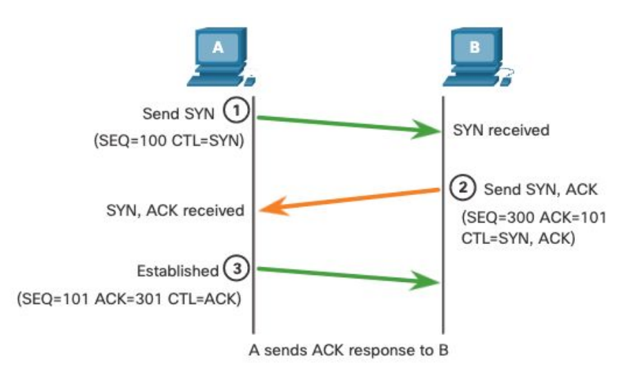
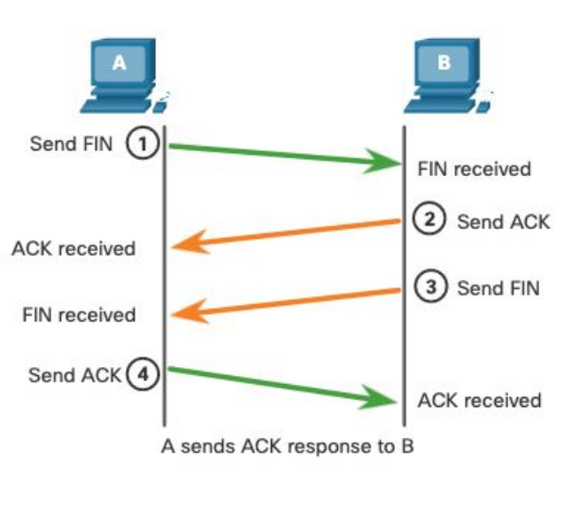

```
Transport Layer/
├── Transport Layer/
│   ├── Role of the Transport Layer/
│   ├── Responsibilities of the Transport Layer/
│   ├── Why Transport Protocols Are Needed/
├── TCP Overview (Transmission Control Protocol)/
│   ├── Key Features of TCP/
│   ├── TCP Header Fields/
│   ├── Applications That Use TCP/
├── UDP Overview/
│   ├── Key Features of TCP:
│   ├── TCP Header Fields
│   ├── Applications That Use TCP
├── Port Numbers/
│   ├── Socket Pairs:
│   ├── Port Number Ranges
│   ├── Examples of Well-Known Ports
│   ├── Checking Connections with netstat
├── Port Numbers/
│   ├── Socket Pairs:
│   ├── Port Number Ranges
│   ├── Examples of Well-Known Ports
│   ├── Checking Connections with netstat
├── TCP Communication Process/
│   ├── TCP Server Processes
│   ├── TCP Connection Establishment (Three-Way Handshake)
│   ├── ACK SYN numbers in Three Way HandShake:
│   ├── Session Termination
│   ├── Purpose of the Three-Way Handshake
│   ├── TCP Control Flags
```

# Transport Layer

The transport layer is the fourth layer in the OSI model. It is responsible for end-to-end communication between devices. This layer ensures that data is delivered reliably, in order, and without errors.


### Role of the Transport Layer  
- Responsible for logical communication between applications on different devices  
- Acts as the link between the application layer and the lower layers (like network and physical layers)  
- Makes sure messages get from one application to another correctly

<br><br>

### Responsibilities of the Transport Layer  
1. Segmentation and Reassembly – Breaks data into smaller chunks for transmission and reassembles them at the destination.  
2. Reliable Delivery (in TCP) – Ensures data arrives correctly, in order, and without loss (using acknowledgments and retransmissions).  
3. Multiplexing and Demultiplexing – Allows multiple applications to send/receive data over the network simultaneously by using port numbers.

<br><br>

### Why Transport Protocols Are Needed  
- IP doesn’t handle how packets are delivered  
- Transport protocols take care of how data moves between devices and whether it arrives reliably or not  
- Main transport layer protocols: TCP and UDP  

<br><br>

## Transmission Control Protocol (TCP)  
TCP is used when reliable communication is needed. Key features:  
- Numbers and tracks data segments sent between devices  
- Acknowledges received data  
- Retransmits data if it wasn’t acknowledged  
- Reorders data if it arrives out of sequence  
- Manages the rate of data flow to avoid overwhelming the receiver  

<br><br>

## User Datagram Protocol (UDP)  
UDP is used when speed matters more than reliability. Key features:  
- Connectionless protocol (no handshake or connection setup)  
- Minimal overhead and checking  
- No acknowledgment or retransmission  
- Called a best-effort delivery protocol  
- Used where small data is sent quickly and occasional loss is acceptable  

<br><br>

## Choosing Between TCP and UDP  

- Use UDP for small, fast request-reply apps (like DNS, voice, video calls, game traffic)  
- Use TCP when it's important that all data is received in order (like web browsing, file transfers, emails)


<br>

___

<br>


# TCP Overview (Transmission Control Protocol)

### Key Features of TCP: 

- Establishes a session  
  TCP sets up a reliable connection between the sender and receiver before transferring data.

- Reliable delivery  
  Ensures all data reaches its destination. Lost or corrupted data is detected and retransmitted.

- Same-order delivery  
  Data segments may arrive out of order due to different network paths. TCP reorders them correctly.

- Flow control  
  Prevents overwhelming the receiver by controlling the rate of data transmission based on receiver capacity.

- Stateful communication  
  TCP tracks sent and received data, keeping the connection active and synchronized.


<br><br>


### TCP Header Fields 

| **Field**               | **Size**  | **Purpose**                                                                 |
|-------------------------|-----------|------------------------------------------------------------------------------|
| Source Port             | 16 bits   | Identifies the sending application                                          |
| Destination Port        | 16 bits   | Identifies the receiving application                                        |
| Sequence Number         | 32 bits   | Keeps track of the byte order for proper data reassembly                    |
| Acknowledgment Number   | 32 bits   | Indicates the next expected byte from the sender                            |
| Header Length (Data Offset) | 4 bits    | Specifies the size of the TCP header                                        |
| Reserved                | 6 bits    | Reserved for future use (usually set to 0)                                  |
| Control Bits (Flags)    | 6 bits    | Used to manage the connection (e.g., SYN, ACK, FIN)                         |
| Window Size             | 16 bits   | Tells the sender how much data the receiver can accept                      |
| Checksum                | 16 bits   | Used for error-checking the segment header and data                         |
| Urgent Pointer          | 16 bits   | Points to urgent data, if the URG flag is set                               |


<br><br>


### Applications That Use TCP

TCP is used by applications that require reliable, ordered, and error-checked delivery, including:

- Web browsing (HTTP, HTTPS)
- Email (SMTP, IMAP, POP3)
- File transfer (FTP)
- Remote login (SSH, Telnet)


<br>

___

<br>


# UDP Overview

#### What is UDP?

UDP (User Datagram Protocol) is a lightweight transport layer protocol that provides basic functions for delivering datagrams between applications. It is fast and simple, but does not guarantee delivery, order, or error correction.

<br><br>

### Key Features of UDP

- No session establishment  
- No guaranteed delivery or retransmission of lost data  
- No reordering of data  
- Sender is not notified about the receiver’s state  
- Less overhead than TCP, making it suitable for speed-sensitive tasks

<br><br>

### UDP Header

The UDP header is 8 bytes long and contains only four fields:

| Field            | Size   | Description                                            |
|------------------|--------|--------------------------------------------------------|
| Source Port      | 16-bit | Identifies the sending application                    |
| Destination Port | 16-bit | Identifies the receiving application                  |
| Length           | 16-bit | Length of UDP header and data                         |
| Checksum         | 16-bit | Basic error checking for header and data              |

<br><br>

### Applications That Use UDP

- Live media streaming (VoIP, live video) – prioritizes speed over accuracy  
- DNS and DHCP – simple request and reply without full sessions  
- SNMP and TFTP – applications that handle reliability themselves  

<br>

___

<br>


# Port Numbers


Port numbers help transport layer protocols (TCP and UDP) handle multiple conversations at once. Each application uses a unique port number so that data reaches the correct destination. <br>

- The source port identifies the sending application on the local device  
- The destination port identifies the receiving application on the remote device

<br><br>

### Socket Pairs

A socket is a combination of:

- IP address + Port number  
- Example: 192.168.1.5:80

Sockets are used to manage multiple sessions on one device, allowing different conversations to occur at the same time.

<br><br>

### Port Number Ranges

| Port Range         | Name                      | Description                                                                 |
|--------------------|---------------------------|-----------------------------------------------------------------------------|
| 0 to 1,023         | Well-known ports          | Reserved for common services like HTTP, FTP, DNS, etc.                      |
| 1,024 to 49,151    | Registered ports          | Assigned by IANA for specific applications like Cisco RADIUS on 1812        |
| 49,152 to 65,535   | Dynamic/Private ports     | Temporary ports assigned by OS for client-side communications               |

<br><br>

### Examples of Well-Known Ports

| Port | Protocol | Application                          |
|------|----------|--------------------------------------|
| 20   | TCP      | FTP (Data)                           |
| 21   | TCP      | FTP (Control)                        |
| 22   | TCP      | SSH                                  |
| 23   | TCP      | Telnet                               |
| 25   | TCP      | SMTP                                 |
| 53   | UDP/TCP  | DNS                                  |
| 67   | UDP      | DHCP (Server)                        |
| 68   | UDP      | DHCP (Client)                        |
| 69   | UDP      | TFTP                                 |
| 80   | TCP      | HTTP                                 |
| 110  | TCP      | POP3                                 |
| 143  | TCP      | IMAP                                 |
| 161  | UDP      | SNMP                                 |
| 443  | TCP      | HTTPS                                |

<br><br>

### Checking Connections with netstat

netstat is a command-line tool to check current TCP/UDP connections.

Example output:

```
C:\> netstat

Active Connections
Proto  Local Address        Foreign Address      State
TCP    192.168.1.124:3126   192.168.0.2:139      ESTABLISHED
TCP    192.168.1.124:3158   207.138.126.152:80   ESTABLISHED
TCP    192.168.1.124:3166   www.cisco.com:80     ESTABLISHED
```

This shows your device's active connections, including local port numbers and destination servers.

<br>

___

<br>


# TCP Communication Process

### TCP Server Processes

- Each server application listens on a specific port number.
- A single server can’t run two services on the same port using the same transport protocol.
- If a port is open, the transport layer accepts and processes segments sent to that port.
- Incoming client requests are accepted if they match the correct socket, and the data is passed to the right server application.

<br><br>

### TCP Connection Establishment (Three-Way Handshake)

This uses a three-step process called the three-way handshake:

1. SYN – Client sends a SYN packet to start a session with the server. The packet includes a random sequence number, like 100.  
2. SYN-ACK – Server responds with a SYN-ACK packet. It includes its own sequence number (e.g. 300) and acknowledges the client’s SYN by setting ACK to 101.  
3. ACK –Client replies with an ACK packet, acknowledging the server’s SYN by setting ACK to 301 with sequence number of 101. The connection is now established.
<br>
Client sends a request to start a session with the server.   <br>
Server acknowledges the request and sends back its own request to start a session in return.   <br>
Client acknowledges the server’s request, completing the handshake. <br>
<br><br>


<br><br>


### ACK SYN numbers in Three Way HandShake:


1. Client → SYN  
   - Sequence number: 100 (randomly chosen by client)  
   - No ACK because it’s the first packet

2. Server → SYN-ACK  
   - Sequence number: 300 (randomly chosen by server)  
   - ACK: 101 (acknowledging client’s SYN of 100, so ACK = 100 + 1)

3. Client → ACK  
   - Sequence number: 101 (next byte from client after SYN)  
   - ACK: 301 (acknowledging server’s SYN of 300, so ACK = 300 + 1)

<br>

so bascically:

- The initial sequence numbers are randomly chosen  
- The ACK numbers are based on the other party's sequence numbers plus one  
- After the handshake, the sequence number continues incrementing with each byte of data sent


<br><br>

### Session Termination

Ending a TCP session also involves multiple steps:

1. Client sends a segment with the FIN flag to indicate it has finished sending data.
2. Server acknowledges the FIN and confirms the client-to-server session is closed.
3. Server sends its own FIN to close the session from its side.
4. Client responds with an ACK to confirm, completing the termination.

<br><br>



<br><br>

### Purpose of the Three-Way Handshake

The **three-way handshake** is used to **establish a reliable TCP connection** between two devices (client and server) before data is transmitted.

It ensures that:
1. **Both sides are ready to communicate.**
2. **Both sides agree on initial sequence numbers.**
3. **The connection is reliable and synchronized.**

<br><br>

### TCP Control Flags

TCP uses six main control bits to manage connections:

| Flag | Meaning                                         |
|------|-------------------------------------------------|
| URG  | Urgent pointer field is significant             |
| ACK  | Acknowledgment flag for connection management   |
| PSH  | Push function, delivers data immediately        |
| RST  | Resets the connection due to errors             |
| SYN  | Synchronizes sequence numbers (used to start)   |
| FIN  | No more data; used to close the connection      |

<br>

___

<br>
