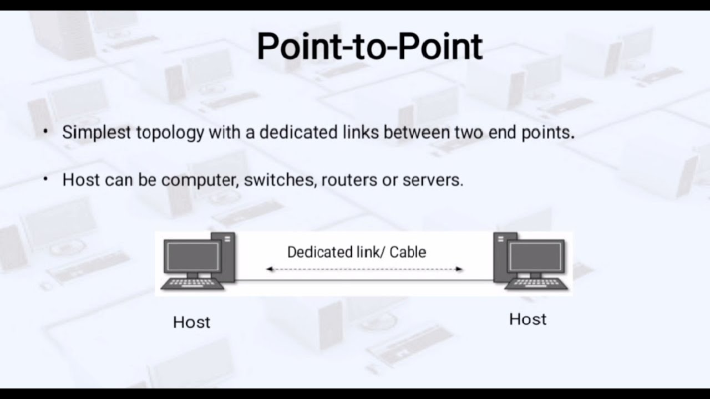
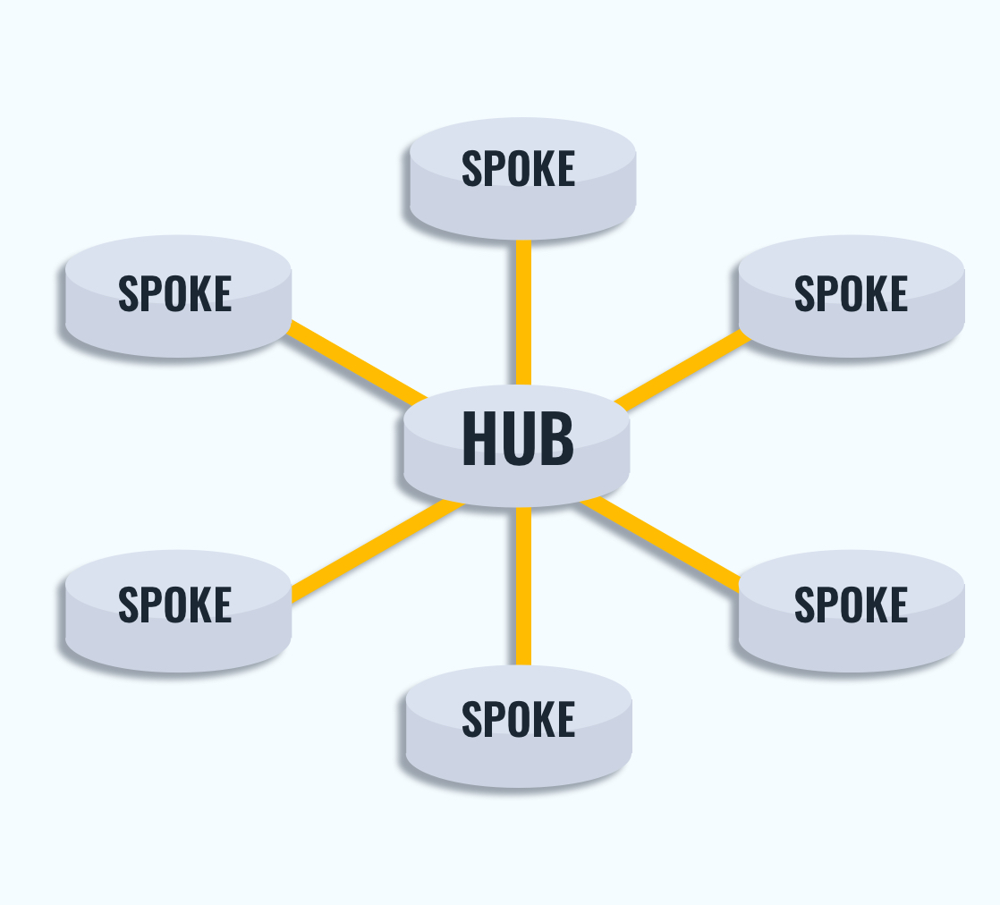
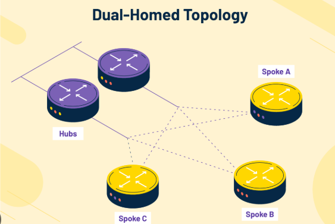
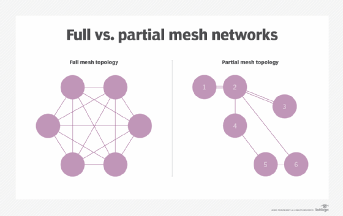

# LAN vs. WAN

A LAN is a network that connects computers and devices in a small area like a home, school, or office. It helps people share files, printers, and internet easily within a short distance. A WAN is a network that connects computers and networks over a very large area, like between cities or countries. The internet is the most common example of a WAN.

 

| Feature           | LAN (Local Area Network)                                      | WAN (Wide Area Network)                                               |
|------------------|---------------------------------------------------------------|------------------------------------------------------------------------|
| Area Covered     | Small area (like a home, school, or office) – up to a few kilometers | Very large area (between cities, countries, or even worldwide) – hundreds to thousands of kilometers |
| What It Connects | Computers and devices nearby                                  | Computers and networks far away                                       |
| Who Owns It      | You or your company                                           | Big companies like internet or phone service providers                |
| Cost to Use      | No extra cost once it's set up                                | You pay to use it (monthly or per use)                                |
| Speed            | Usually fast (Wi-Fi or cable)                                 | Speed can be slower or faster depending on the service                |

 

___

 

# Private vs. Public WAN

### Private WAN  
A private WAN is a network connection that is used only by one customer or organization. It does not share the connection with others.

Key features:
- Guaranteed service quality  
- Steady and consistent bandwidth  
- Higher security  

### Public WAN
A public WAN is a shared connection, usually provided by an Internet Service Provider (ISP), over the internet.

Key features:
- No guaranteed service quality  
- Bandwidth and speed may change  
- Lower security due to shared access  

 

___

 

# WAN Topologies

Types of WAN Topologies:  
1. Point-to-Point Topology  
2. Hub-and-Spoke Topology  
3. Dual-Homed Topology  
4. Fully Meshed Topology  
5. Partially Meshed Topology  

 

1. Point-to-Point Topology  
- Connects two locations directly using a dedicated link  
- Simple and reliable for small networks  
- The service provider handles the connection (Layer 2 transport)  
- Becomes expensive if many connections are needed, since each site needs its own link

 

2. Hub-and-Spoke Topology  
- One central hub router connects to multiple spoke routers  
- Spokes can only communicate through the hub  
- Uses fewer links, making it cost-effective  
- The hub is a single point of failure — if it goes down, spokes can't talk to each other

 

3. Dual-Homed Topology   
A dual-homed topology means that one site (like an office or branch) is connected to two different networks or service providers instead of just one. This gives the network two separate paths to the internet or other sites.

Think of it like this:  
If you normally have one road to get to school (single-homed), and that road is blocked, you're stuck. But if you have two roads (dual-homed), you can still get there even if one road is closed.

**Key benefits of dual-homed topology:**  
- Provides redundancy in case one connection fails  
- Allows load balancing by sharing traffic between connections  
- Offers a backup connection using a second ISP or provider  
- Increases reliability and uptime for important services  

It is more expensive and harder to set up than single-homed networks, because it needs extra routers or switches and more advanced configurations.

 

4. Fully Meshed Topology  
- All sites are directly connected to every other site  
- Highest fault tolerance — if one connection fails, others are still available  
- Very expensive and complicated due to the number of links required

 

5. Partially Meshed Topology  
- Only some sites are directly connected  
- Balances cost and fault tolerance  
- Less reliable than full mesh, but more efficient than hub-and-spoke

 

___

 

# Carrier Connections  
To use a WAN and connect to the internet, a company needs to work with a service provider (like an internet company). The company and the provider usually sign a service level agreement, or SLA. This agreement explains how good and reliable the internet connection should be.
  

### What is a carrier?  
A carrier is the company that owns and takes care of the physical parts of the network, like cables and equipment. Sometimes the service provider and the carrier are the same, and sometimes they are different.
  

### Types of connections

1. Single-carrier connection  
   The company uses only one service provider.  
   There is just one SLA.  
   It is easier to manage and usually costs less.  
   But if the connection goes down, there is no backup.
  

2. Dual-carrier connection  
   The company uses two different service providers.  
   There are two separate SLAs.  
   This setup gives backup and is more reliable.  
   If one connection fails, the other can still keep things running.

 

___

 

# Evolving networks  

As a company grows, its network needs change.   
The network should work well for daily tasks and also be able to grow as the company gets bigger.   
Network designers and IT staff choose the right tools, internet providers, and systems to help the network grow and work better. 
 
To understand this, let’s look at a made-up company called SPAN Engineering as it grows over time.

  

### Small network  

SPAN started as a small company with just a few workers in one office.  
- They used one local network (LAN) and a wireless router to share files and printers.  
- Their internet came through DSL, a common broadband connection.  
- The DSL company also gave them IT support.

  

### Campus network  

After a few years, SPAN grew and moved into several floors in one building.  
- They now needed a bigger network called a campus area network (CAN).  
- A firewall was added to protect internet access.  
- The company also hired its own IT staff to take care of the network.

  

### Branch network  

Later, SPAN opened new offices in the same city and in other cities.  
- They needed a metropolitan area network (MAN) to connect the offices inside the city.  
- Offices in other cities used private lines from local internet providers to connect to the main office.

  

### Distributed network  

After 20 years, SPAN had many offices around the world and thousands of employees.  
- They used VPNs (Virtual Private Networks) to connect their offices and workers through the internet.  
- VPNs made it easy and safe to work from different places.

 

___

 

