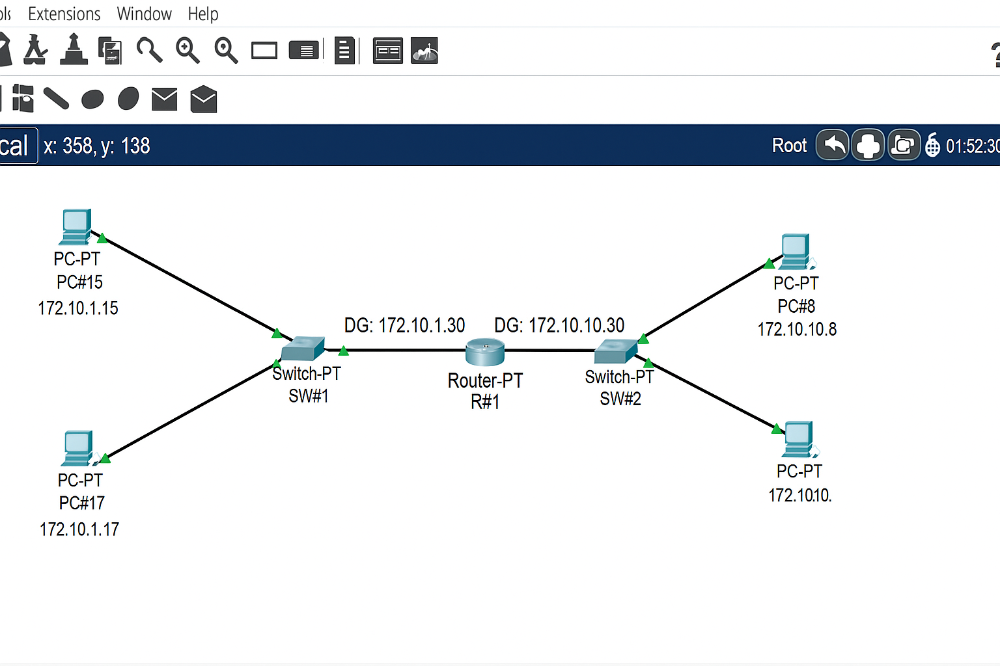

You are given a simple network topology where two LANs are connected using a router in the middle.
Each LAN contains two PCs connected through a switch.


### Network Details

| Device    | Interface | IP Address   | Subnet Mask   | Default Gateway |
| --------- | --------- | ------------ | ------------- | --------------- |
| PC15      | NIC       | 172.10.1.15  | 255.255.255.0 | 172.10.1.30     |
| PC17      | NIC       | 172.10.1.17  | 255.255.255.0 | 172.10.1.30     |
| PC8       | NIC       | 172.10.10.8  | 255.255.255.0 | 172.10.10.30    |
| PC12      | NIC       | 172.10.10.12 | 255.255.255.0 | 172.10.10.30    |
| Router R1 | G0/0      | 172.10.1.30  | 255.255.255.0 | —               |
| Router R1 | G0/1      | 172.10.10.30 | 255.255.255.0 | —               |


### Question

You are the network engineer.
Your task is to configure the network so that all PCs can communicate with each other successfully through the router.

#### Step 1 – Assign IP addresses

Assign the given IP addresses to all PCs as per the table above.

#### Step 2 – Configure Router Interfaces

Access the router (R1) and configure both interfaces with the correct IP addresses.

**Commands:**

```
R1>enable
R1#configure terminal
R1(config)#interface gigabitEthernet0/0
R1(config-if)#ip address 172.10.1.30 255.255.255.0
R1(config-if)#no shutdown

R1(config)#interface gigabitEthernet0/1
R1(config-if)#ip address 172.10.10.30 255.255.255.0
R1(config-if)#no shutdown
R1(config)#exit
R1#copy running-config startup-config
```


#### Step 3 – Set Default Gateways on PCs

On each PC:

1. Go to **Desktop → IP Configuration**
2. Set the **Default Gateway** as follows:

   * PCs in LAN 1 → `172.10.1.30`
   * PCs in LAN 2 → `172.10.10.30`


#### Step 4 – Test Connectivity

Use the `ping` command to test communication between devices:

```
From PC15 → ping 172.10.10.8
From PC8  → ping 172.10.1.15
```

If configured correctly, you should get successful replies.


### Expected Output

| From | To   | Result         |
| ---- | ---- | -------------- |
| PC15 | PC8  | Reply received |
| PC17 | PC12 | Reply received |
| PC15 | PC17 | Reply received |
| PC8  | PC12 | Reply received |


### Explanation

* Each LAN is on a different subnet:

  * LAN 1 → 172.10.1.0/24
  * LAN 2 → 172.10.10.0/24
* The router connects both networks and routes packets between them.
* The default gateways on PCs point to the router’s interface IP within their respective subnets.


<br>

___

<br>





<br>

___

<br>
