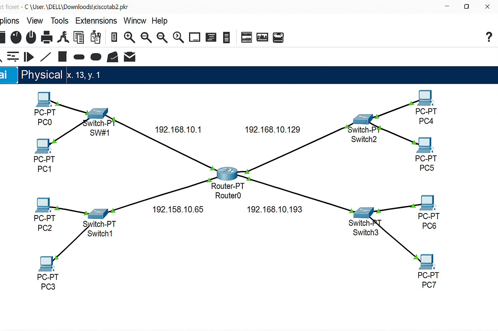

You are given a topology where a central router connects **three different LANs** through switches.
Each LAN has its own network address, and the goal is to configure the router and PCs so that all devices across the three LANs can communicate with each other.


### Network Details

| Network | Device             | Interface      | IP Address     | Subnet Mask   | Default Gateway |
| ------- | ------------------ | -------------- | -------------- | ------------- | --------------- |
| LAN 1   | PC0                | NIC            | 192.168.10.2   | 255.255.255.0 | 192.168.10.1    |
| LAN 1   | PC1                | NIC            | 192.168.10.3   | 255.255.255.0 | 192.168.10.1    |
| LAN 1   | Switch             | —              | —              | —             | —               |
| Router  | GigabitEthernet0/0 | 192.168.10.1   | 255.255.255.0  | —             |                 |
| LAN 2   | PC2                | NIC            | 192.158.10.2   | 255.255.255.0 | 192.158.10.65   |
| LAN 2   | PC3                | NIC            | 192.158.10.3   | 255.255.255.0 | 192.158.10.65   |
| LAN 2   | Switch             | —              | —              | —             | —               |
| Router  | GigabitEthernet0/1 | 192.158.10.65  | 255.255.255.0  | —             |                 |
| LAN 3   | PC4                | NIC            | 192.168.10.130 | 255.255.255.0 | 192.168.10.129  |
| LAN 3   | PC5                | NIC            | 192.168.10.131 | 255.255.255.0 | 192.168.10.129  |
| LAN 3   | PC6                | NIC            | 192.168.10.194 | 255.255.255.0 | 192.168.10.193  |
| LAN 3   | PC7                | NIC            | 192.168.10.195 | 255.255.255.0 | 192.168.10.193  |
| Router  | GigabitEthernet0/2 | 192.168.10.129 | 255.255.255.0  | —             |                 |
| Router  | GigabitEthernet0/3 | 192.168.10.193 | 255.255.255.0  | —             |                 |


### Question

You are the network engineer.
Your task is to configure the router and all connected PCs so that communication between all LANs is possible.


### Step 1 – Assign IP Addresses to PCs

Manually assign the IPs to each PC based on the table above.

Example for PC0:

* IP Address: `192.168.10.2`
* Subnet Mask: `255.255.255.0`
* Default Gateway: `192.168.10.1`

Repeat for all PCs with their respective gateways.


### Step 2 – Configure Router Interfaces

Access the router (Router0) and configure the interfaces as shown.

**Commands:**

```
Router>enable
Router#configure terminal

Router(config)#interface gigabitEthernet0/0
Router(config-if)#ip address 192.168.10.1 255.255.255.0
Router(config-if)#no shutdown

Router(config)#interface gigabitEthernet0/1
Router(config-if)#ip address 192.158.10.65 255.255.255.0
Router(config-if)#no shutdown

Router(config)#interface gigabitEthernet0/2
Router(config-if)#ip address 192.168.10.129 255.255.255.0
Router(config-if)#no shutdown

Router(config)#interface gigabitEthernet0/3
Router(config-if)#ip address 192.168.10.193 255.255.255.0
Router(config-if)#no shutdown

Router(config)#exit
Router#copy running-config startup-config
```


### Step 3 – Set Default Gateways on All PCs

Each PC should use the IP address of its connected router interface as the **default gateway**.

| LAN    | Default Gateway |
| ------ | --------------- |
| LAN 1  | 192.168.10.1    |
| LAN 2  | 192.158.10.65   |
| LAN 3A | 192.168.10.129  |
| LAN 3B | 192.168.10.193  |


### Step 4 – Test Connectivity

Use the `ping` command to verify communication between networks.

**Example tests:**

```
From PC0 → ping 192.168.10.131
From PC3 → ping 192.168.10.2
From PC5 → ping 192.158.10.2
From PC7 → ping 192.168.10.3
```

If properly configured, all devices across different LANs should successfully communicate.


### Expected Output

| From | To  | Result         |
| ---- | --- | -------------- |
| PC0  | PC5 | Reply received |
| PC2  | PC7 | Reply received |
| PC4  | PC1 | Reply received |
| PC6  | PC3 | Reply received |


### Explanation

* Each LAN belongs to a **different subnet**.
* The router is configured with **four interfaces**, each serving as the gateway for its respective subnet.
* Once IPs and gateways are set correctly, the router routes traffic between the subnets.


<br>

___

<br>





<br>

___

<br>
